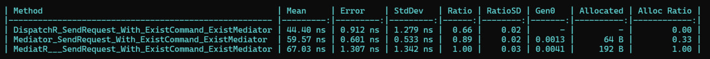

DispatchR 🚀
============

### A High-Performance Mediator Implementation for .NET
## 🔥 Features
- ⚡ 3x faster than MediatR in benchmarks
- 🏗️ Zero-allocation architecture
- 🧩 Modular pipeline design
- 📦 MediatR compatible
- 🛠️ Built-in DI support

# Bechmark Result:

