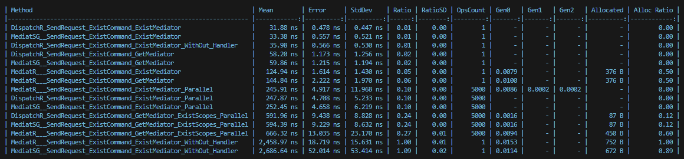
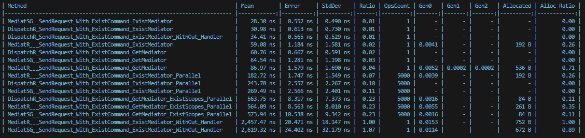

# DispatchR 🚀


[](https://www.nuget.org/packages/DispatchR.Mediator)
[](https://www.nuget.org/packages/DispatchR.Mediator)

### A High-Performance Mediator Implementation for .NET :trollface: 
** *Minimal memory footprint. Blazing-fast execution.* **

> [!NOTE]
> If you're curious to see the power of this library, [check out the benchmark](https://github.com/hasanxdev/DispatchR?tab=readme-ov-file#-bechmark-result) comparing MediatR vs Mediator Source Generator vs DispatchR.

## ⚡ Key Features
- 🧩 Built entirely on top of Dependency Injection
- 🚫 Zero runtime reflection after registration
- 🔧 Choose your handler return type: `Task`, `ValueTask`, or `Synchronous Method`
- 🧠 Allocates nothing on the heap — ideal for high-throughput scenarios
- ⚡ Outperforms existing solutions in most real-world benchmarks
- 🔄 Seamlessly compatible with MediatR — migrate with minimal effort
> :bulb: **Tip:** *If you're looking for a mediator with the raw performance of hand-written code, DispatchR is built for you.*

# Syntax Comparison: DispatchR vs MediatR

###### In the following, you will see the key differences and implementation details between MediatR and DispatchR.

## ✅ Request Definition

### MediatR
```csharp
public sealed class PingMediatR : IRequest<int> { }
```

### DispatchR
1. Sending `TRequest` to `IRequest`
2. Precise selection of output for both `async` and `sync` handlers 
   1. Ability to choose between `Task` and `ValueTask`

```csharp
public sealed class PingDispatchR : IRequest<PingDispatchR, ValueTask<int>> { } 
```

## ✅ Handler Definition

### MediatR
```csharp
public sealed class PingHandlerMediatR : IRequestHandler<PingMediatR, int>
{
    public Task<int> Handle(PingMediatR request, CancellationToken cancellationToken)
    {
        return Task.FromResult(0);
    }
}
```

### DispatchR (Don't change)

```csharp
public sealed class PingHandlerDispatchR : IRequestHandler<PingDispatchR, ValueTask<int>>
{
    public ValueTask<int> Handle(PingDispatchR request, CancellationToken cancellationToken)
    {
        return ValueTask.FromResult(0);
    }
}
```

## ✅ Pipeline Behavior

### MediatR
```csharp
public sealed class LoggingBehaviorMediat : IPipelineBehavior<PingMediatR, int>
{
    public Task<int> Handle(PingMediatR request, RequestHandlerDelegate<int> next, CancellationToken cancellationToken)
    {
        return next(cancellationToken);
    }
}
```

### DispatchR
1. Use ___Chain of Responsibility___ pattern

```csharp
public sealed class LoggingBehaviorDispatchR : IPipelineBehavior<PingDispatchR, ValueTask<int>>
{
    public required IRequestHandler<PingDispatchR, ValueTask<int>> NextPipeline { get; set; }

    public ValueTask<int> Handle(PingDispatchR request, CancellationToken cancellationToken)
    {
        return NextPipeline.Handle(request, cancellationToken);
    }
}
```

## 🔍 Summary

- **DispatchR** lets the request itself define the return type.
- **No runtime reflection** in DispatchR — it's optimized for performance.
- **No static behavior chains** — pipelines are chained via DI and handler wiring.
- **Supports `void`, `Task`, or `ValueTask`** as return types.

Ideal for high-performance .NET applications.


# ⚡ How DispatchR Achieves High Performance

###### DispatchR is designed with one goal in mind: **maximize performance with minimal memory usage**. Here's how it accomplishes that:

## 🔍 What Happens Inside the `Send` Method?

```csharp
public TResponse Send<TRequest, TResponse>(IRequest<TRequest, TResponse> request,
    CancellationToken cancellationToken) where TRequest : class, IRequest, new()
{
    return serviceProvider
        .GetRequiredService<IRequestHandler<TRequest, TResponse>>()
        .Handle(Unsafe.As<TRequest>(request), cancellationToken);
}
```

✅ **Only the handler is resolved and directly invoked!**

But the real magic happens behind the scenes when DI resolves the handler dependency:
> 💡 __Tips:__ *We cache the handler using DI, so in scoped scenarios, the object is constructed only once and reused afterward.*
```csharp
services.AddScoped(handlerInterface, sp =>
{
    var pipelines = sp
        .GetServices(pipelinesType)
        .Select(s => Unsafe.As<IRequestHandler>(s)!);

    IRequestHandler lastPipeline = Unsafe.As<IRequestHandler>(sp.GetService(handler))!;
    foreach (var pipeline in pipelines)
    {
        pipeline.SetNext(lastPipeline);
        lastPipeline = pipeline;
    }

    return lastPipeline;
});
```

✨ This elegant design chains pipeline behaviors at resolution time — no static lists, no reflection, no magic.


## 🧠 Smarter LINQ: Zero Allocation

##### To further reduce memory allocations, DispatchR uses **zLinq**, a zero-allocation LINQ implementation, instead of the default LINQ. This means even in heavy pipelines and high-frequency requests, memory remains under control.
> Of course, our goal is to stay dependency-free — but for now, I think it's totally fine to rely on this as a starting point!

## 🪴 How to use?
It's simple! Just use the following code:
```csharp
builder.Services.AddDispatchR(typeof(MyCommand).Assembly);
```
This code will automatically register all pipelines by default. If you need to register them in a specific order, you can either add them manually or write your own reflection logic:
```csharp
builder.Services.AddDispatchR(typeof(MyCommand).Assembly, withPipelines: false);
builder.Services.AddScoped<IPipelineBehavior<MyCommand, int>, PipelineBehavior>();
builder.Services.AddScoped<IPipelineBehavior<MyCommand, int>, ValidationBehavior>();
```
### 💡 Key Notes:
1. Automatic pipeline registration is enabled by default
2. Manual registration allows for custom pipeline ordering
3. You can implement custom reflection if needed

## ✨ How to install?
```
dotnet add package DispatchR.Mediator --version 1.0.0
```

# 🧪 Bechmark Result:
> [!IMPORTANT]
> This benchmark was conducted using MediatR version 12.5.0 and the stable release of Mediator Source Generator, version 2.1.7.
Version 3 of Mediator Source Generator was excluded due to significantly lower performance.

#### 1. MediatR vs Mediator Source Generator vs DispatchR With Pipeline

#### 2. MediatR vs Mediator Source Generator vs DispatchR Without Pipeline


## ✨ Contribute & Help Grow This Package! ✨
We welcome contributions to make this package even better! ❤️
 - Found a bug? 🐛 → Open an issue
 - Have an idea? 💡 → Suggest a feature
 - Want to code? 👩💻 → Submit a PR

Let's build something amazing together! 🚀